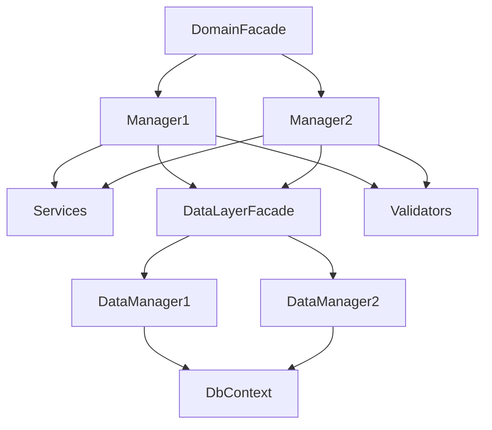

# Surf fares

## Tools

- install vs code mermaid extension to view the diagrams

## Archtitecture Air.Domain.Fares

https://www.youtube.com/watch?v=t6i0XJQoKnY

```mermaid
graph TD
    DomainFacade --> Manager1
    DomainFacade --> Manager2
    Manager1 --> Services
    Manager1 --> DataLayerFacade
    Manager1 --> Validators
    Manager2 --> Services
    Manager2 --> DataLayerFacade
    Manager2 --> Validators
    DataLayerFacade --> DataManager1
    DataLayerFacade --> DataManager2
    DataManager1 --> DbContext
    DataManager2 --> DbContext
```
