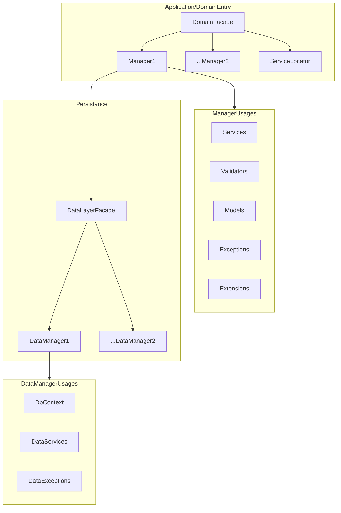
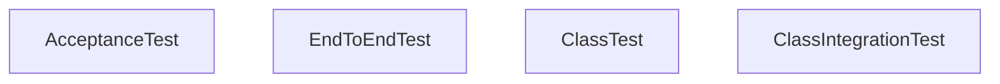

# Surf fares

## Dev environment

The dev environment is bootstrapped with dot sourcing the root/init.ps1 script. Dot source it with . .\init.ps1 or . ./init.ps1.

## Dev tools

Dev tools dependencies and environment are maintained in script (/scripts/_check-dev-dependencies.ps1). It will get checked when dot sourcing init.ps1.

## Helpful VS Code extensions

- install vs code mermaid extension to view the diagrams
- install vs code liveserver to have updating report pages

## Setup Rider with TUnit

## User Stories - Maintained on GitHub Kanban

- As a user I want to be able to get cheap fares to my favourite surf destinations.
- As a user I want to discover new surf destinations
- As a user I want the best deals for travel
- As a user I want to see the conditions at the destination
- As a user I want to be able to try the newsletter for free
- As a user I want to be able to subscribe to the surfletter
- As a user I want to be able to unsubscribe to the surfletter
- As a user I want to be able to be able to become a premium member
- As a premium user I want personalized premium content
- As a user I want safe emails with links that is safe
- As a user I want a affordable prize for the newsletter
- As a user I want to feel good when I read the email:
    - Not bloated with ads and images

## Free content ideas
- Fixed origin list
- Fixed destination list
- Limited updates

## Premium content ideas
- Custom

## Web page (icebox)
- Landing page
- Content:
    -
- Subscribe to newsletter
- Influencer trials

## Archtitecture Air.Domain.Fares

Inspired from @matlus Shiv Kumar
https://www.youtube.com/watch?v=t6i0XJQoKnY

## Test Philosophy

- Minimize isolation testing
- Test only classes that are too complex in isolation
- Only replace leaf classes with test doubles if needed
- Expose as little of the system as possible and focus on features
- As much as possible should be refactable without breaking tests

### Acceptance tests

We should rely on acceptance tests as much as possible and test as big part of a functionality as possible.

Caveats:
- The "seems" should be drawn at where things stop being reliable - example a test database is mostly reliable for unit testing but not a production database
- Dependencies that absoluty need to be replaced to test (should only be the leaf classes at the edges of the system, like HttpMessageHandler or urls and connection strings)

### Acceptance test implementation

- Create the acceptance tests in pseudocode - prepare the big functional test - implement as much as you can of the AAA (this can be the hardest part to identify the requirements).
- Scrap coding, scetch coding, wip coding, *scrap unit testing* - embrace removing code and tests dont merry them.
- If we test the happy path first we do not need validation in step 1 so we can focus on the call chain
