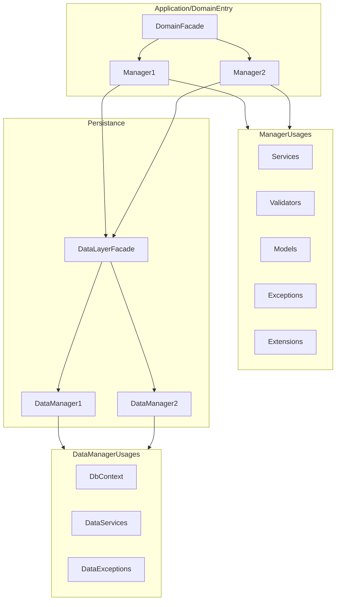

# Surf fares

## Tools

- install vs code mermaid extension to view the diagrams

## User Stories - Maintained on GitHub Kanban

- As a user I want to be able to get cheap fares to my favourite surf destinations.
- As a user I want to discover new surf destinations
- As a user I want the best deals for travel
- As a user I want to see the conditions at the destination
- As a user I want to be able to try the newsletter for free
- As a user I want to be able to subscribe to the surfletter
- As a user I want to be able to unsubscribe to the surfletter
- As a user I want to be able to be able to become a premium member
- As a premium user I want personalized premium content
- As a user I want safe emails with links that is safe
- As a user I want a affordable prize for the newsletter
- As a user I want to feel good when I read the email:
    - Not bloated with ads and images

## Free content ideas
- Fixed origin list
- Fixed destination list
- Limited updates

## Premium content ideas
- Custom

## Web page (icebox)
- Landing page
- Content:
    -
- Subscribe to newsletter
- Influencer trials

## Archtitecture Air.Domain.Fares

Inspired from @matlus Shiv Kumar
https://www.youtube.com/watch?v=t6i0XJQoKnY

